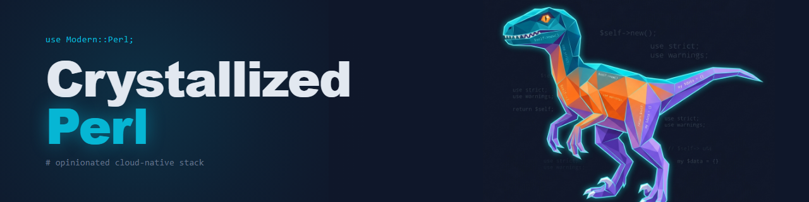

  

# Crystallized Perl

Stack completo e opinativo para serviços de internet modernos em Perl.

---

> Um stack completo e opinativo para construir serviços de internet modernos em Perl —
> aplicações web, APIs HTTP e workers em background — fundamentado em referências reais
> e decisões arquiteturais documentadas.

---

## O que este stack cobre

- Aplicações web com HTML server-rendered e SPAs com backend Perl
- APIs HTTP: REST, GraphQL e WebSocket
- Workers em background e filas de jobs (processamento assíncrono)
- Autenticação, autorização e gerenciamento de sessões
- Observabilidade: logging, métricas e rastreamento distribuído
- Containerização com Docker e implantação cloud-native (Kubernetes ou equivalentes)
- Pipelines de CI/CD automatizados
- Estratégia de testes: unitários, integração e end-to-end
- Ferramental de desenvolvimento e ambiente local com Docker Compose

## O que este stack NÃO cobre

- Sistemas operacionais, módulos de kernel ou drivers de dispositivo
- Engines de jogos ou gráficos em tempo real
- Ciência de dados, aprendizado de máquina ou pipelines de dados
- Desenvolvimento genérico de frameworks ou bibliotecas Perl
- ETL batch ou data warehousing
- Aplicações desktop ou GUI

## Fundamentos

Cada escolha tecnológica deste stack rastreia ao menos uma fonte autoritativa
externa, documentada em [`docs/references/`](docs/references/).
Nenhuma decisão é justificada por "senso comum" — cada uma tem uma ADR.

| Referência | Tipo | Relevância para o stack |
|------------|------|------------------------|
| [perl.org](docs/references/perl-org.md) | Portal Oficial | Documentação e ecossistema oficial da linguagem |
| [Modern Perl](docs/references/modern-perl-book.md) | Livro | Idiomas e boas práticas Perl contemporâneos |
| [The Twelve-Factor App](docs/references/twelve-factor-app.md) | Metodologia | Princípios guia para aplicações cloud-native |
| [Docker](docs/references/docker.md) | Documentação Oficial | Containerização — base da infraestrutura do stack |
| [Mojolicious](docs/references/mojolicious.md) | Documentação Oficial | Framework web Perl moderno — escolhido em [ADR-004](docs/adrs/ADR-004-framework-web-mojolicious.md) |
| [Kubernetes](docs/references/kubernetes.md) | Documentação Oficial | Orquestração de containers — escolhido em [ADR-010](docs/adrs/ADR-010-orquestracao-kubernetes.md) |

Ver [`docs/references/`](docs/references/) para as 36 fontes completas.

## Stack tecnológico

| Camada | Tecnologia | ADR |
|--------|-----------|-----|
| Linguagem | Perl 5.42+ | [ADR-005](docs/adrs/ADR-005-gerenciamento-de-dependencias.md) |
| Framework web | Mojolicious + Hypnotoad | [ADR-004](docs/adrs/ADR-004-framework-web-mojolicious.md) |
| Dependências | Carton + cpanm | [ADR-005](docs/adrs/ADR-005-gerenciamento-de-dependencias.md) |
| Orientação a objetos | Moo + Moo::Role | [ADR-006](docs/adrs/ADR-006-sistema-de-oo-moo.md) |
| Banco de dados | PostgreSQL 17 | [ADR-007](docs/adrs/ADR-007-banco-de-dados-relacional-postgresql.md) |
| Acesso relacional | Mojo::Pg + Mojo::Pg::Migrations | [ADR-016](docs/adrs/ADR-016-acesso-a-dados-relacional-mojo-pg.md) |
| Dados documentais | PostgreSQL JSONB | [ADR-017](docs/adrs/ADR-017-acesso-a-dados-documentos-jsonb.md) |
| Message broker | RabbitMQ (AMQP 0-9-1) | [ADR-008](docs/adrs/ADR-008-message-broker-rabbitmq.md) |
| Autenticação | Keycloak + JWT / Crypt::JWT | [ADR-009](docs/adrs/ADR-009-autenticacao-keycloak-jwt.md) |
| Contrato de API | OpenAPI v3 (documentação) | [ADR-015](docs/adrs/ADR-015-contrato-de-api-openapi-v3.md) |
| Testes | Test::Mojo + prove + Devel::Cover | [ADR-011](docs/adrs/ADR-011-estrategia-de-testes.md) |
| Containerização | Docker multi-stage build | [ADR-005](docs/adrs/ADR-005-gerenciamento-de-dependencias.md) |
| Orquestração | Kubernetes + InitContainer | [ADR-010](docs/adrs/ADR-010-orquestracao-kubernetes.md) |
| CI/CD | GitHub Actions | — |
| Site de docs | Docusaurus | — |

Todas as decisões de stack estão documentadas em [`docs/adrs/`](docs/adrs/)
(ADR-000 a ADR-018). A aplicação de demonstração que exercita todo o stack é
a **Stega** — ver [ADR-018](docs/adrs/ADR-018-aplicacao-de-demonstracao.md).

## Documentação

O site completo da documentação está em:

**[hibex-solutions.github.io/crystallized-perl](https://hibex-solutions.github.io/crystallized-perl)**

Estrutura da documentação neste repositório:

| Diretório | Conteúdo |
|-----------|---------|
| [`docs/adrs/`](docs/adrs/) | Architectural Decision Records — cada decisão significativa tem uma ADR |
| [`docs/references/`](docs/references/) | 36 fontes externas anotadas que fundamentam as decisões |
| `docs/guides/` | Tutoriais passo a passo (em desenvolvimento) |
| `docs/stack/` | Referência por camada tecnológica (em desenvolvimento) |

## Como contribuir

Leia [CONTRIBUTING.md](CONTRIBUTING.md) antes de abrir um pull request.

Em especial:
- Erros de conteúdo → use o template **Correção de Conteúdo**
- Novos guias → abra uma issue antes de escrever
- Nova ADR → leia [ADR-000](docs/adrs/ADR-000-padrao-de-adrs.md) primeiro
- Contestar ADR existente → abra uma issue com evidência e proposta de substituição

Ao contribuir, você concorda em seguir nosso [Código de Conduta](CODE_OF_CONDUCT.md).

## Licença

MIT © 2026 [Hibex Solutions](https://github.com/Hibex-Solutions)

Ver [LICENSE](LICENSE) para o texto completo.
