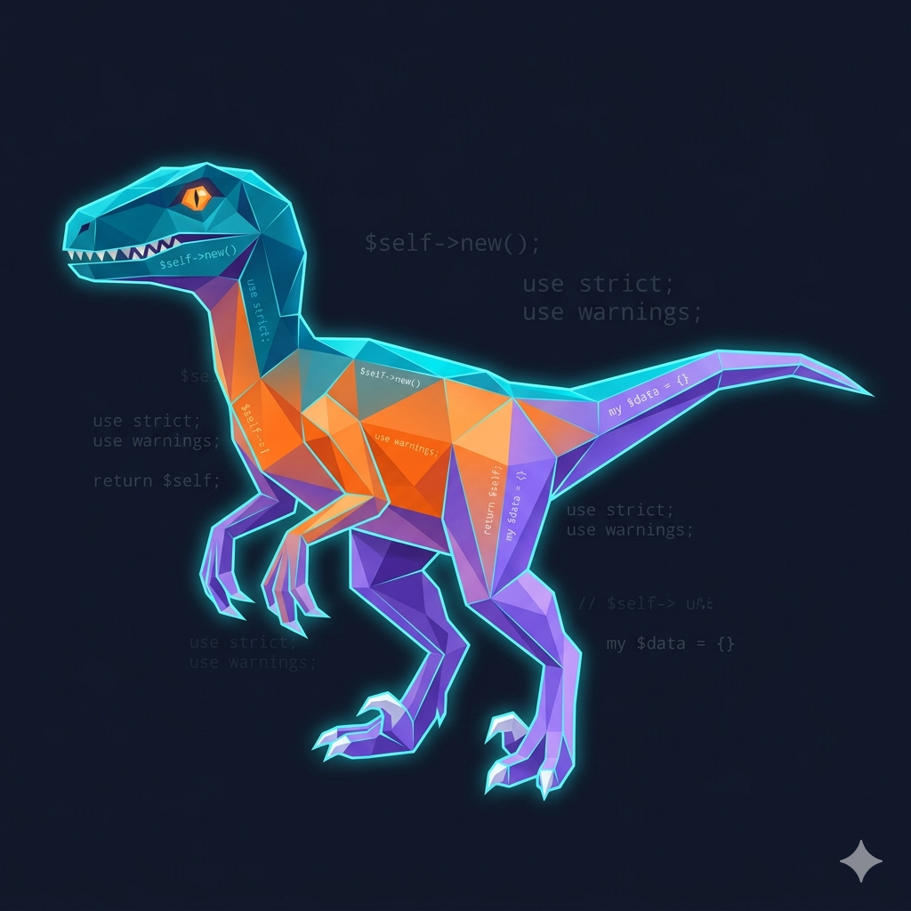
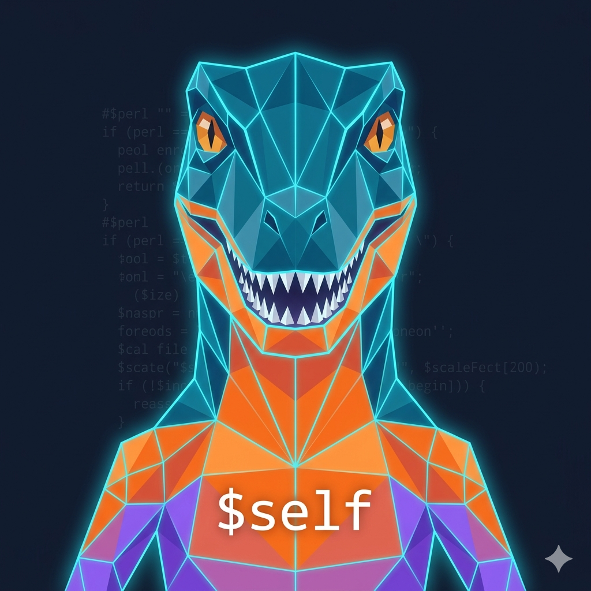
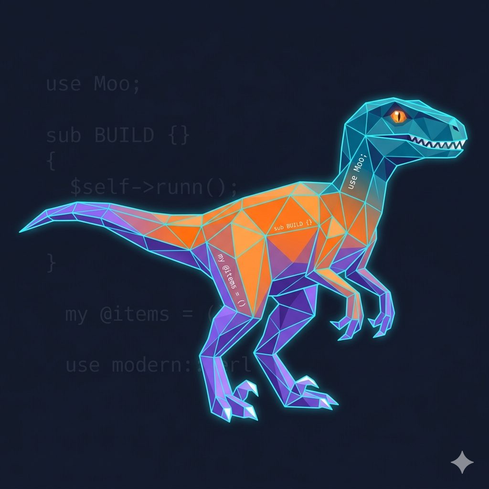

# ADR-002: Mascote — Raptor Cristalizado

**Status**: Aceita  
**Data**: 2026-06-26

## Contexto

Projetos de documentação com forte identidade visual têm maior reconhecimento e engajamento.
O Perl possui dois símbolos amplamente reconhecidos: o camelo (trademark O'Reilly, alto
reconhecimento, restrições de uso) e o velociraptor (símbolo comunitário, sem restrições).
Uma escolha de mascote deve ser original, livre de barreiras legais, e deve comunicar a
proposta do projeto de forma visual e conceitual.

## Decisão

**Mascote: Raptor Cristalizado** (Crystal Raptor)

Um velociraptor renderizado em estilo *low-poly* / geométrico-cristalino, com as seguintes
características:

- **Silhueta externa**: forma orgânica do raptor — reconhecível pela comunidade Perl
- **Preenchimento interno**: facetas triangulares/poligonais com gradiente de cores
  da paleta do projeto (ver ADR-003)
- **Elementos de código**: fragmentos de sintaxe Perl modernos visíveis nas facetas,
  conectando o mascote diretamente à linguagem
- **Três ângulos canônicos**: vista lateral esquerda, frontal e lateral direita
  (conforme concept art em [`references/raptor-cristal-draft.png`](references/raptor-cristal-draft.png))

### Metáfora conceitual

| Elemento visual | Significado |
|----------------|-------------|
| Silhueta orgânica do raptor | Perl clássico — poderoso, moldado nos anos 90 |
| Facetas geométricas internas | Modernização — ordem matemática, boas práticas, cloud-native |
| Transição de cores (turquesa → laranja → roxo) | Refração da luz em um cristal; transparência estrutural |
| Código Perl nas facetas | A linguagem é a substância, não apenas a forma |

A metáfora é: o mesmo animal, estruturado por práticas de engenharia modernas. O Perl
não mudou de natureza — foi lapidado.

## Justificativa

1. **Sem barreiras de trademark**: O raptor é símbolo comunitário do Perl, sem restrições
   de uso (ao contrário do camelo O'Reilly que exige permissão formal)
2. **Diferenciação**: O tratamento cristalino/low-poly é original no ecossistema Perl;
   não existe outro projeto com este tratamento visual
3. **Coerência com a tese do projeto**: A "lapidação" geométrica é exatamente a metáfora
   de modernização — o mesmo poder, estruturado por disciplina técnica
4. **Escalabilidade vetorial**: O estilo low-poly funciona em 32px (favicon) e em formatos
   grandes (banner 1280×320, og-image 1200×630)

> Referência interna: [`references/RASCUNHO.md`](references/RASCUNHO.md) — seções "Uma
> Metáfora Conceitual" e "Direção de Arte para o Logo e Identidade Visual";
> concept art [`references/raptor-cristal-draft.png`](references/raptor-cristal-draft.png).

Referências externas:
- [`perl-org`](../references/perl-org.md) — portal oficial da comunidade Perl; o raptor é símbolo comunitário mantido por essa mesma comunidade
- [`modern-perl-book`](../references/modern-perl-book.md) — o raptor está associado à cultura "Modern Perl" que este livro representa

## Alternativas Consideradas

| Alternativa | Motivo da rejeição |
|-------------|-------------------|
| Camelo O'Reilly | Trademark registrado; uso requer permissão formal da O'Reilly |
| Cebola Perl (Perl Onion) | Menor reconhecimento; sem metáfora visual de modernização |
| Raptor clássico sem estilização | Já existe na comunidade; sem diferenciação; sem metáfora |
| Símbolo abstrato / ícone original | Perde a conexão com a herança visual da comunidade Perl |

## Consequências

- **Positivo**: Mascote original, sem problemas legais, com forte fundação conceitual
- **Positivo**: Concept art já produzido (`references/raptor-cristal-draft.png`) como
  referência para produção do asset final
- **Negativo**: Requer produção de arte final em SVG (o concept art é raster PNG, não
  pronto para produção como `assets/images/logo.svg` e `assets/images/banner.svg`)
- **Ação necessária**: Comissionar SVG final a partir do concept art em `references/`

---

## Imagens de Referência — Prompts de Geração

Os prompts abaixo foram elaborados a partir do rascunho inicial
(`references/raptor-cristal-draft.png`) e da paleta definida em
[ADR-003](ADR-003-paleta-de-cores-e-tipografia.md) para guiar a geração das três
vistas canônicas via Google Imagen 2.

As imagens geradas estão salvas em `references/` e exibidas abaixo de cada prompt.

---

### Vista Lateral Esquerda

**Arquivo**: `docs/adrs/references/raptor-lateral-esquerda.png`

```text
Low-poly crystalline velociraptor mascot, full body, strict left side profile,
dinosaur facing left. The raptor stands in an alert dynamic posture — weight on both
feet, head angled slightly forward. Classic velociraptor silhouette: large clawed feet,
long tail, short forearms, prominent elongated skull.

Surface: Entire body composed of precise triangular and polygonal geometric facets,
flat-shaded, clean sharp edges between polygons. No organic scales or skin — only
crystalline polygons, gemstone aesthetic.

Colors (head to tail gradient): Deep teal-blue (#007399) on head, neck, upper spine →
vibrant orange (#F97316) on torso and ribs → violet-purple (#8B5CF6) on lower belly,
legs, tail. Bright cyan (#06B6D4) luminescent neon glow on all facet edges.

Embedded code: Faint but readable modern Perl 5.38+ code fragments etched on key
body facets in white monospaced font — "$self->new()", "use strict;", "use warnings;",
"return $self;", "my $data = {}".

Eye: Left eye visible, glowing amber-orange (#F59E0B), geometric slit pupil.
Teeth: White crystalline triangular shards along the jaw line.

Lighting: Internal luminescence from within the crystal facets — no external light
source, no hard cast shadows. The mascot glows from within.

Background: Deep slate navy (#0F172A), near-black solid fill. Faint ghost Perl code
text at ~12% opacity scattered in the background for subtle texture.

Composition: Centered horizontally, full body visible with generous padding on all
sides. Dinosaur fills approximately 70% of frame height, facing left.

Technical: 1024x1024 px square, flat dark background, crisp sharp facet edges
throughout, high contrast figure on dark background.

Style: low-poly 3D concept art, crystalline gemstone illustration, sci-fi character
design, clean geometric vector aesthetic rendered as raster.

Negative: photorealistic dinosaur skin or scales, organic fur or texture, watercolor,
ink sketch, blurry or soft edges, cartoon cute style, chibi proportions, decorative
borders or frames, watermark, text labels overlaid on the image frame, human figures,
gradient background fill.
```



---

### Vista Frontal

**Arquivo**: `docs/adrs/references/raptor-frontal.png`

```text
Low-poly crystalline velociraptor mascot, head-on frontal portrait, perfectly centered.
Showing head, neck, chest and partial upper arms. Classic velociraptor head shape —
elongated skull, prominent jaw, forward-facing intimidating posture.

Surface: Entire visible surface composed of precise triangular and polygonal geometric
facets, flat-shaded crystalline polygons, sharp clean edges between each polygon.
No organic skin texture or scales.

Colors (top to bottom gradient, consistent with lateral views): Deep teal-blue (#007399)
facets on the skull, top of head, and upper neck → vibrant orange (#F97316) facets on
the lower neck, chest, and visible forearm areas → violet-purple (#8B5CF6) on the
lower chest edges and forearm tips. Bright cyan (#06B6D4) luminescent neon lines mark
all facet edges throughout. The gradient flows vertically from head to body — not split
left-to-right.

Eyes: Both eyes visible and symmetrical — each eye is rendered in the same low-poly
geometric style as the rest of the body: a few flat-shaded polygonal facets forming a
simplified eye shape, amber-orange (#F59E0B) iris color with a dark vertical slit
pupil suggestion. The eye reads as a velociraptor slit eye but abstracted into the
same triangular facet language as every other surface. Not photorealistic, not a
crystal gem orb — a low-poly polygon eye.

Jaw: Slightly open, revealing white crystalline triangular teeth arranged in two rows.

Embedded code: The text "$self" legibly printed on the large central chest facet in
white monospaced font.

Lighting: Strong internal glow emanating from within the crystalline structure,
radiating outward through the facet edges. No external directional light source.

Background: Deep slate navy (#0F172A). Faint Perl code ghost text at ~12% opacity
distributed radially behind the mascot.

Composition: Fully symmetrical layout — both color and form. Head fills the upper
two-thirds of the frame, chest and partial forearms in the lower third. Perfectly
centered, generous padding on all sides.

Technical: 1024x1024 px square, flat dark background, sharp crisp facet edges,
high contrast.

Style: low-poly crystal art, sci-fi mascot character portrait, frontal orthographic
character sheet view.

Negative: diagonal left-right color split on the face or body, asymmetric eye colors,
photorealistic reptile eyes, crystal gem orb eyes, glowing jewel eyes, smooth organic
eye rendering, side view, profile view, full body from feet to tail, photorealistic
skin, organic texture, watercolor, sketch, cartoon, chibi, cute style, decorative
border or frame, watermark, text labels overlaid on the image frame, gradient
background.
```



---

### Vista Lateral Direita

**Arquivo**: `docs/adrs/references/raptor-lateral-direita.png`

```text
Low-poly crystalline velociraptor mascot, full body, strict right side profile,
dinosaur facing right — opposite direction from the left profile view. Same alert
posture — weight distributed on both legs, tail extended horizontally for balance,
head angled slightly forward.

Surface: Entire body composed of precise triangular and polygonal geometric facets,
flat-shaded, identical facet quality and density as the left profile. No organic scales
or skin texture.

Colors (head to tail gradient): Deep teal-blue (#007399) on head and neck → vibrant
orange (#F97316) on torso and mid-back → violet-purple (#8B5CF6) on lower body, legs,
tail tip. Bright cyan (#06B6D4) luminescent neon edges on all facet boundaries.

Embedded code: Different Perl 5.38+ code fragments visible on key body facets in white
monospaced font — "use Moo;", "sub BUILD {}", "$self->run()", "my @items = ()",
"use modern::perl".

Eye: Right eye visible, glowing amber-orange (#F59E0B), geometric slit pupil.
Teeth: White crystalline triangular shards along the jaw line.

Lighting: Internal luminescence from the crystal structure — same quality as left
profile, mirrored. No external directional light source.

Background: Deep slate navy (#0F172A). Faint background Perl ghost code text at ~12%
opacity.

Composition: Centered, full body visible, dinosaur facing right, generous padding on
all sides. Fills approximately 70% of frame height.

Technical: 1024x1024 px square, facing right (not left), crisp sharp facet edges
throughout.

Style: low-poly 3D concept art, crystalline gemstone illustration, sci-fi character
design, clean geometric vector aesthetic rendered as raster.

Negative: facing left or mirrored, photorealistic dinosaur scales or skin, organic
texture, watercolor, sketch, blurry edges, cartoon, chibi, text labels overlaid on
the image frame, watermark, gradient background fill.
```


