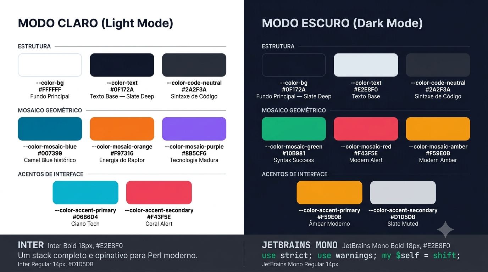

# ADR-003: Paleta de Cores e Tipografia

**Status**: Aceita  
**Data**: 2026-06-26

## Contexto

A identidade visual do projeto exige um sistema de cores consistente para o site de
documentação, mascote e demais assets. O sistema deve suportar modo claro e escuro,
comunicar modernidade e precisão técnica, e manter vínculo semântico com a herança
visual do Perl e com o mascote Raptor Cristalizado (ADR-002).

## Decisão

### Paleta de Cores

Os tokens abaixo são o contrato de design para todo o projeto. A implementação concreta
será feita via CSS custom properties no tema Docusaurus.

#### Modo Claro (Light Mode)

| Token | Hex | Nome semântico |
|-------|-----|----------------|
| `--color-bg` | `#FFFFFF` | Fundo principal |
| `--color-text` | `#0F172A` | Texto base (Slate Deep) |
| `--color-code-neutral` | `#2A2F3A` | Sintaxe de código (neutral) |
| `--color-mosaic-blue` | `#007399` | Mosaico azul — Camel Blue histórico |
| `--color-mosaic-orange` | `#F97316` | Mosaico laranja — energia do Raptor |
| `--color-mosaic-purple` | `#8B5CF6` | Mosaico roxo — tecnologia madura |
| `--color-accent-primary` | `#06B6D4` | Acento primário (Ciano Tech) |
| `--color-accent-secondary` | `#F43F5E` | Acento secundário (Coral Alert) |

#### Modo Escuro (Dark Mode)

| Token | Hex | Nome semântico |
|-------|-----|----------------|
| `--color-bg` | `#0F172A` | Fundo principal (Slate Deep) |
| `--color-text` | `#E2E8F0` | Texto base |
| `--color-code-neutral` | `#2A2F3A` | Sintaxe de código (neutral) |
| `--color-mosaic-green` | `#10B981` | Mosaico verde (Syntax Success) |
| `--color-mosaic-red` | `#F43F5E` | Mosaico vermelho/coral (Modern Alert) |
| `--color-mosaic-amber` | `#F59E0B` | Mosaico âmbar (Modern Amber) |
| `--color-accent-primary` | `#F59E0B` | Acento primário (Âmbar Moderno) |
| `--color-accent-secondary` | `#D1D5DB` | Acento secundário (Slate Muted) |

**Nota**: O modo escuro usa um conjunto de mosaicos diferente do modo claro. Isso é
intencional — a metáfora do cristal refrata cores distintas dependendo do ângulo de luz.
A implementação deve garantir que os tokens de mosaico não sejam misturados entre modos.

### Tipografia

| Uso | Fonte selecionada | Alternativas consideradas |
|-----|------------------|--------------------------|
| Títulos, interface, corpo de texto | **Inter** | Poppins, Montserrat |
| Blocos de código e exemplos Perl | **JetBrains Mono** | Fira Code |

Ambas as fontes são open-source e disponíveis via Google Fonts / JetBrains.

## Justificativa

### Cores

- **Azul `#007399`**: referência explícita ao "Camel Blue" histórico do Perl — aceno de
  continuidade com a herança da linguagem sem usar o trademark do camelo
- **Laranja `#F97316`**: conecta ao livro *Modern Perl* de brian d foy, cuja identidade
  visual usa laranja como cor dominante; simboliza a energia ativa do projeto
- **Roxo `#8B5CF6`**: profundidade e maturidade tecnológica; completa o trio de mosaico
  criando a transição cromática do cristal
- **Ciano `#06B6D4`** (acento primário, light): tecnologia e precisão; cloud-native vibe
- **Âmbar `#F59E0B`** (acento primário, dark): calor e clareza sobre fundo escuro
- **`#0F172A` como base dupla**: a mesma cor serve como texto no modo claro e como fundo
  no modo escuro — sistema coeso, fácil de implementar e verificar

### Tipografia

- **Inter**: projetada para telas, excelente legibilidade em tamanhos pequenos de UI,
  geometria limpa sem serifa; padrão de facto em documentações técnicas modernas
- **JetBrains Mono**: fonte mono-espaçada com ligaduras projetada especificamente para
  código; suporte completo a operadores Perl (`->`, `=>`, `//`, `!=`); amplamente adotada

> Referência interna: [`references/RASCUNHO.md`](references/RASCUNHO.md) — seções "Uma
> Paleta de Cores Cristalina" e "Tipografia"; guia visual
> [`references/raptor-cristal-palette-draft.png`](references/raptor-cristal-palette-draft.png).

Referências externas:
- [`modern-perl-book`](../references/modern-perl-book.md) — identidade visual laranja do livro é a origem semântica do `#F97316`

## Alternativas Consideradas

| Alternativa | Motivo da rejeição |
|-------------|-------------------|
| Navy + Amber (sugestão inicial do CLAUDE.md) | Substituída pela paleta cristalina, semanticamente integrada com ADR-002 |
| Paleta monocromática | Não comunica a metáfora de refração do cristal; menos expressiva |
| Poppins (heading) | Inter tem legibilidade superior em tamanhos pequenos de UI |
| Fira Code (mono) | JetBrains Mono tem ligaduras mais completas para operadores Perl |

## Consequências

- **Positivo**: Sistema de dois modos completo e documentado com tokens CSS nomeados
- **Positivo**: Vínculo semântico entre cada cor e a metáfora do mascote (ADR-002)
- **Positivo**: Tokens prontos para implementar como override no tema Docusaurus
- **Negativo**: Mosaicos distintos por modo requerem atenção na implementação do tema
- **Ação necessária**: Verificar contraste WCAG 2.1 AA de todos os pares texto/fundo
  antes de finalizar o site (`#0F172A` sobre `#FFFFFF` e `#E2E8F0` sobre `#0F172A`)

---

## Imagem de Referência — Prompt de Geração

O prompt abaixo descreve um painel de documentação visual da paleta para geração via
Google Imagen 2. **Não inclui o mascote** — apenas os tokens de cor e as amostras
tipográficas, em contraste com o rascunho misto em
`references/raptor-cristal-palette-draft.png`.

A imagem gerada está salva em `references/` e exibida abaixo do prompt.

---

### Guia Visual da Paleta

**Arquivo**: `docs/adrs/references/palette-guide.png`

```text
A professional color system documentation panel titled "Crystallized Perl — Sistema de
Cores". Pure design-system infographic — no illustrations, no mascot, no animals, no
decorative graphics of any kind.

Layout: Landscape rectangle divided into two equal vertical halves by a thin vertical
divider in #2A2F3A. No outer border.

LEFT HALF — "MODO CLARO (Light Mode)":
Solid white (#FFFFFF) background filling the entire left half. Section title "MODO CLARO
(Light Mode)" in Inter Bold, color #0F172A, all-caps, at the top.

Three labeled subsections, each preceded by a small all-caps label in Inter SemiBold:

  ESTRUTURA — three color swatches in a horizontal row, each a rounded rectangle
  (approximately 80x80 px) filled with its color, labeled below with token name in
  JetBrains Mono small, hex code in Inter Bold, semantic name in Inter Regular small:
    Swatch #FFFFFF (white fill with thin #E2E8F0 stroke border to be visible)
      "--color-bg / #FFFFFF / Fundo Principal"
    Swatch #0F172A (dark fill, light-colored label text)
      "--color-text / #0F172A / Texto Base — Slate Deep"
    Swatch #2A2F3A (dark fill, light-colored label text)
      "--color-code-neutral / #2A2F3A / Sintaxe de Código"

  MOSAICO GEOMÉTRICO — three swatches:
    Swatch #007399 → "--color-mosaic-blue / #007399 / Camel Blue histórico"
    Swatch #F97316 → "--color-mosaic-orange / #F97316 / Energia do Raptor"
    Swatch #8B5CF6 → "--color-mosaic-purple / #8B5CF6 / Tecnologia Madura"

  ACENTOS DE INTERFACE — two swatches:
    Swatch #06B6D4 → "--color-accent-primary / #06B6D4 / Ciano Tech"
    Swatch #F43F5E → "--color-accent-secondary / #F43F5E / Coral Alert"

RIGHT HALF — "MODO ESCURO (Dark Mode)":
Solid deep slate (#0F172A) background filling the entire right half. Section title
"MODO ESCURO (Dark Mode)" in Inter Bold, color #E2E8F0, all-caps, at the top.
Label and description text in #E2E8F0 (light) throughout this half.
Same three-section structure as the left half:

  ESTRUTURA:
    Swatch #0F172A (with thin #2A2F3A stroke to be visible on dark bg)
      "--color-bg / #0F172A / Fundo Principal — Slate Deep"
    Swatch #E2E8F0 → "--color-text / #E2E8F0 / Texto Base"
    Swatch #2A2F3A → "--color-code-neutral / #2A2F3A / Sintaxe de Código"

  MOSAICO GEOMÉTRICO:
    Swatch #10B981 → "--color-mosaic-green / #10B981 / Syntax Success"
    Swatch #F43F5E → "--color-mosaic-red / #F43F5E / Modern Alert"
    Swatch #F59E0B → "--color-mosaic-amber / #F59E0B / Modern Amber"

  ACENTOS DE INTERFACE:
    Swatch #F59E0B → "--color-accent-primary / #F59E0B / Âmbar Moderno"
    Swatch #D1D5DB → "--color-accent-secondary / #D1D5DB / Slate Muted"

BOTTOM STRIP (full width, spanning both halves):
Solid #2A2F3A background. Two typography specimens side by side with a thin divider:

  Left specimen:
    Label "INTER" in Inter Bold 18px, color #E2E8F0.
    Below: "Um stack completo e opinativo para Perl moderno." in Inter Regular 14px,
    color #D1D5DB.

  Right specimen:
    Label "JETBRAINS MONO" in JetBrains Mono Bold 18px, color #E2E8F0.
    Below: "use strict; use warnings; my $self = shift;" in JetBrains Mono Regular
    14px, color #10B981 (green syntax highlight effect).

Overall aesthetic: Clean flat design, no drop shadows, consistent internal padding
throughout, thin #2A2F3A divider lines between subsections within each half,
professional corporate design system documentation quality. All text is crisp and
anti-aliased.

Technical: 1600x900 px landscape 16:9 aspect ratio. Left half is genuinely solid
white (#FFFFFF). Right half is genuinely solid dark (#0F172A). Crisp rendering at
100% and 200% zoom.

Negative: raptor, velociraptor, dinosaur, any animal or mascot, character
illustration, watercolor, photographic textures, rough or grungy edges, dark
background on the left half section, vignette, gradient background fills, any
decorative art elements, blurry text or swatches.
```


