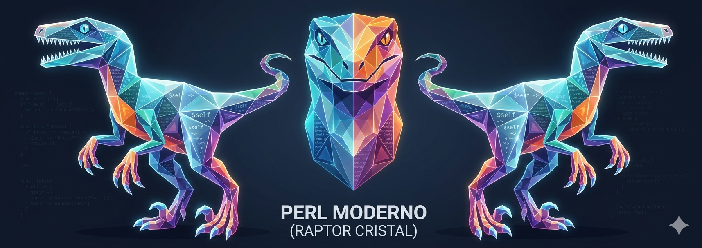
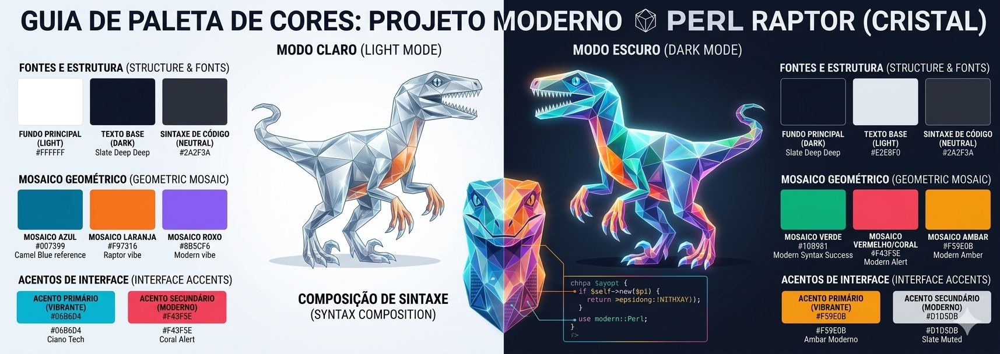

# Rascunho com ideia central para nome, mascote e paleta de cores

> Essas são anotações de uma ideia para ser usada como base e definir um
> nome para o projeto (e repositório), e sua identidade visual (mascote,
> paleta de cores e outras imagens).

Queremos dar a ideia de percepção matemática e estrutural que toca no coração
do que significa "Modernizar" o código e o ecossistema.

O que queremos descrever não é apenas estética; mas uma metáfora visual para o
uso do Perl Moderno para desenvolvimento NativeNative.

O Perl tradicional (muitas vezes criticado por ser "desajeitado" ou difícil de ler
por quem não conhece) se transforma em algo elegante, limpo, estruturado e
performático quando aplicamos boas práticas modernas e a matemática/lógica correta
de engenharia de software. Uma malha poligonal (low-poly/cristalizada) representa
essa lapidação técnica.

Para clarear e estruturar esse conceito podemos dividi-lo em três pilares fundamentais:

1. Uma Metáfora Conceitual

A Silhueta Tradicional (O Legado): A silhueta orgânica do Raptor original representa o
Perl clássico — poderoso, mas moldado nos anos 90, com suas curvas livres e às vezes
imprevisíveis.

A Malha Poligonal (A Modernização): Os triângulos e polígonos geométricos trazem
ordem através da matemática simples. Cada polígono é um pedaço de código limpo,
uma boa prática, uma ferramenta moderna (Kubernetes, Cloud, The Twelve-Factor App,
Mojolicious). Juntos, eles conectam os pontos e dão uma nova estrutura rígida,
transparente e cristalina ao "monstro" antigo.

2. Uma Paleta de Cores Cristalina

Para reforçar a ideia de transparência e matemática clara, podemos ajustar a paleta
para usar cores que conversem bem entre si, simulando a refração da luz em um cristal.
Em vez de cores puramente aleatórias, os polígonos do Raptor podem fazer uma
transição suave entre:

O Azul-Celeste/Turquesa do Camelo (#00A8CC): Para manter o vínculo inquebrável com a
história do Perl e a cor que a comunidade reconhece imediatamente.

O Laranja/Coral do Raptor (#FF6B6B ou #FF8E53): Simbolizando a energia ativa e o
dinamismo do livro Modern Perl.

O Roxo Sóbrio (#6C5CE7): Usado nas conexões internas, trazendo profundidade e o ar
de "tecnologia madura".

3. Direção de Arte para o Logo e Identidade Visual

Contraste de Linhas: A silhueta externa pode manter o formato icônico que todo
desenvolvedor Perl reconhece de longe. Porém, o preenchimento interno é composto
por facetas geométricas limpas.

Transparência Simétrica: Os polígonos não devem ser caóticos. Eles devem seguir
uma lógica matemática clara, com linhas bem definidas (vetoriais simples), passando
a sensação de que o design foi planejado milimetricamente.

Tipografia: Para acompanhar esse Raptor cristalizado, precisamos de uma tipografia
limpa, geométrica e sem serifa (como Poppins, Inter ou Montserrat) em conjunto com
uma fonte mono-espaçada extremamente nítida (como JetBrains Mono ou Fira Code)
para exemplificar respectivamente textos e códigos.

## Rascunho de imagens

Temos duas imagens como rascunho para tentar representar as ideias:

